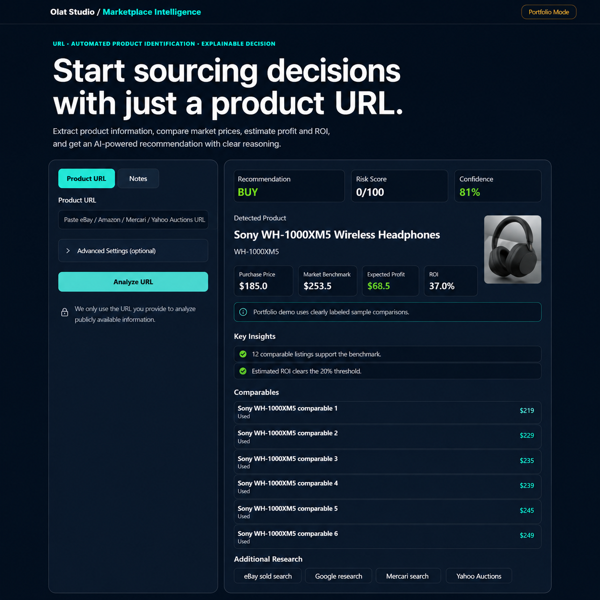

# Marketplace Intelligence Dashboard

A Python-based marketplace intelligence dashboard for sourcing decisions.

## Features

- Analyze marketplace product URLs
- Automatic product identification
- Market benchmark estimation
- Profit & ROI calculation
- BUY / REVIEW / REJECT recommendation
- Explainable decision logic
- Optional eBay API integration

## Tech Stack

- Python
- Flask
- Requests
- BeautifulSoup
- REST API
- HTML/CSS

## Screenshot

Portfolio demonstration of the dashboard interface.
